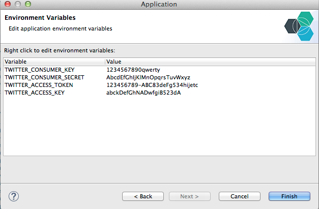
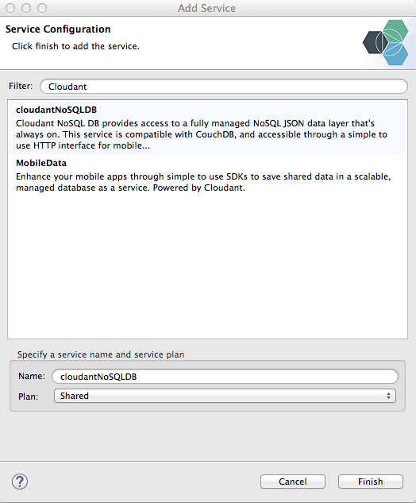
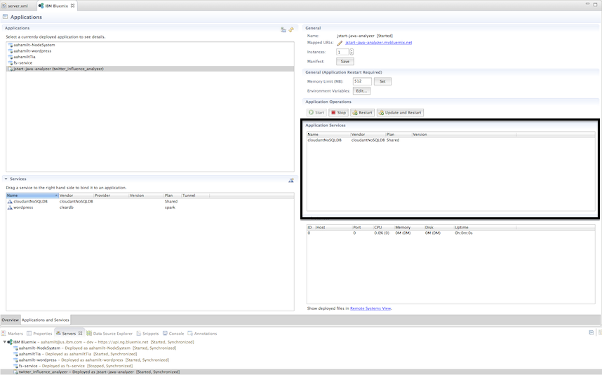
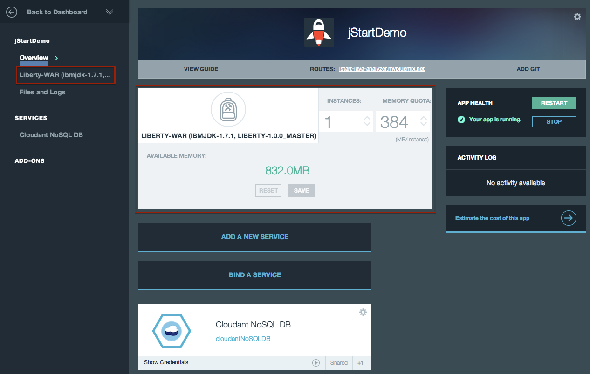

# What is Twitter Personality Insights Analyzer?

This is a simple application that I built to play with [IBM Watson Services](http://www.ibm.com/smarterplanet/us/en/ibmwatson/developercloud/services-catalog.html).
The business logic of the application is simple.

Given a Twitter id,
* (a) it extracts the last 10 tweets from the timeline
* (b) uses the [Language Identification](http://www.ibm.com/smarterplanet/us/en/ibmwatson/developercloud/language-identification.html) service to identify the language of each tweet
* (c) if a tweet is not in English, uses the [Machine Translation] service to translate it to English
* (d) uses the [Personality Insights](http://www.ibm.com/smarterplanet/us/en/ibmwatson/developercloud/personality-insights.html) to build a profile of personality and social characteristics based on the tweets

The main idea was to check how easy/hard it is to build an application using the IBM Watson Services. This application used the [Bluemix Twitter Influence Java Sample](https://github.com/ibmjstart/bluemix-java-sample-twitter-influence-app) and
getting started java samples from each of the services as a guide.

## Screenshots ##

This is the home screen of the app. You can enter a twitter screen name in the text box and click the Analyze button to see their influence.

After entering the twitter name and clicking the Analyze button, the personality results will be shown in the next screen along with the tweets that were used as data.

# Prerequisite #

## Twitter access token ##

This application requires an access token to access the tweets.

### These are some of the steps and screen-shots to register your app with Twitter:

-   You can register the app over [here](https://dev.twitter.com/). When you click on the link you are forwarded to Twitter's developer site. You need to Sign-in with your Twitter account. If you dont have the twitter account you can sign-up with twitter and get then login with the new account credentials. The Sign-in button is on the top right.

    

-   After logging in with the Twitter credentials, you can manage your existng applications or create/register new applications with Twitter by clicking on 'My Applications' as shown in the screenshot.

    

-   Now you can see your existing applications if you have any registered before. You can register the app by clicking on 'Create a new application' button.

    

-   You will now have to fill the application details, agree the rules and the submit the form to register the app.

    

-   After registering the app, you'll see the API key and API
    secret values under the API Keys tab. To get your API access token, click
    'Create my access token' at the bottom of the page and you will see the generated access token and access token secret
    

-   You can just copy these tokens (API  key, API secret, access token, access token secret) in your application and you are all set to use the Twitter API. You will need to check the [documentation](https://dev.twitter.com/docs/api/1.1) to use the various REST APIs.

# How to Run and Deploy the Twitter Personal Analyzer #

Give it a try! Click the button below to fork into IBM DevOps Services and deploy your own copy of this application on Bluemix. Note the app will not yet work; you need to set the environment variables.

The environment variables are your twitter API keys.

To set them, click on your app within Bluemix, click `Environment Variables` on the left pane, then select `USER_DEFINED` to add the three necessary environment variables. Put in your Twitter consumer key, Twitter consumer secret, and Klout key with the EXACT names shown below:

  

Hit save and you're done!

## License ##
Licensed under the Apache License, Version 2.0 (the "License"); you may not use this file except in compliance with the License. You may obtain a copy of the License at

     http://www.apache.org/licenses/LICENSE-2.0

### Step 4. Deploying the app ###

#### • Set up Bluemix Server ####

Make sure you are in the Java EE [perspective](http://help.eclipse.org/juno/index.jsp?topic=%2Forg.eclipse.platform.doc.user%2Fconcepts%2Fconcepts-4.htm) in Eclipse.  

  1. In the bottom window section, select the **Servers** tab.  (Alternatively, you can click: `Window > Show View > Servers`)
  2. Right-Click inside the Servers panel and select `New > Server`
  3. Select, `IBM > IBM Bluemix` and click `Next`.
  4. Enter your login information for Bluemix in the email and password sections.
  5. From the URL dropdown menu, choose: `IBM Bluemix`
  6. Hit `Next` and Bluemix will automatically validate your account credentials.
  7. Optional: Select the Organization within your Bluemix account that you would like to deploy to.
  8. Click: Finish

#### • Push the app ####
  1. Right-Click on the Bluemix server and click: `Connect`  (Optional)
  2. Right-Click on the Bluemix server and select: `Add and Remove...`
  3. Select your Twitter Influence Analyzer project from the window on the left and click: `Add >`
  4. Click: `Finish`
  5. Enter a Name for your app and select: `Next`
  6. Enter THE SAME subdomain that you used to register with Twitter. (e.g. `https://`**`myTwitterApp`**`.mybluemix.net`) Click `Next`
  7. Create and bind the Cloudant NoSQLDB service. If it is not already created, select the icon in the top right. (Refer to Option B of [Creating a Cloudant Service](#cloudant) for how to search and create the service.)
    The application is built to assume that you leave the default name of "cloudantNoSQLDB" for your service name. If you change the name, the app may break. Hit `Next`  
  8. **IMPORTANT:** Add your Twitter API credentials under environment variables. Right click, and select `Add`. Provide this information:

   | Variable Name             |  Variable Value                      |
   |---------------------------|--------------------------------      |
   | TWITTER_CONSUMER_KEY      | `{Your Twitter API Key}`             |
   | TWITTER_CONSUMER_SECRET   | `{Your Twitter API Secret}`          |
   | TWITTER_ACCESS_TOKEN      | `{Your Twitter Access Token}`        |
   | TWITTER_ACCESS_KEY        | `{Your Twitter Access Token Secret}` |

   

   9. You may do this step later, but your application will fail without it. Click: `Finish`. Your app will deploy to Bluemix. If you haven't already created and bound your cloudant service, please refer to Step 5: Create a Cloudant Service

**CONGRATS!**  Your app is now published to Bluemix.  
(Note: It can take a few minutes to upload everything and deploy all of the services.)

###  Step 5. Create a Cloudant service ###

There are two ways to create and bind the cloudant service to your application.

Option A. Using the ACE UI:

  1. In your web browser, go to: [https://ace.ng.bluemix.net](https://ace.ng.bluemix.net)
  2. Login and scroll down to the **Services** section
  3. Click: `Add a service`
  4. Click on the service labeled: `CloudantNoSQLDB`
  5. Click: `Add to Application`
  6. From the drop down menu, select your new app.
  7. Click: `Create`

Option B. Using the Eclipse plugin for Bluemix
  1. Double click your application under the IBM Bluemix server.
  2. Under the services selection, select the "add a service icon" in the top right. (It is just an icon)
  3. Search for cloudantNoSQLDB, and select the first option. Give it a name and pick the shared plan.
  
  4. Select `Finish`. This will create the service in your Bluemix organization.
  5. Under services, where your new service (with the name you specified) shows, drag the new service to "Application Services" on the right side of Eclipse. (Verify that you have the right application with the application name.)
  
  6. Click `Update and Restart` to restart your app with the new service.

### Step 6. Adding Environment Variables through ACE ###

Another option is to add the environment variables through ACE.
  1. Go to Bluemix, and navigate to your dashboard.
  2. Select the application that you deployed earlier on eclipse.
  3. On the app information page, click the buildpack, LIBERTY-WAR (IBMJDK)... either on the left side under your app name, or in the middle.
  
  4. Under Environment Variables, select `USER_DEFINED` and enter the same information specified in the table under Step 4.
  5. Select `Save`. Restart your app. It may take a few minutes for the changes to be recorded.

### Step 7. Explore your app ####

  1. Navigate to the main dashboard view in Bluemix
  2. Find your new app on the Dashboard.
  3. Below the name of your app is a link that takes you to the running app.  Click on that link.
