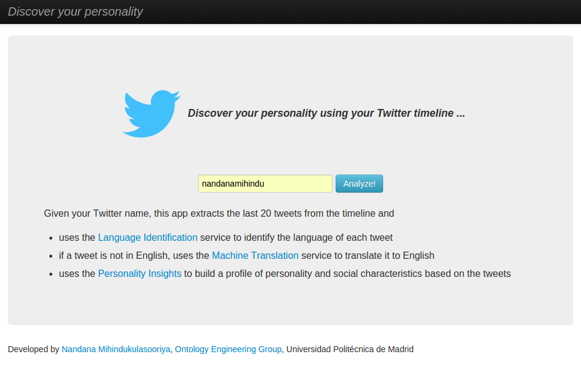
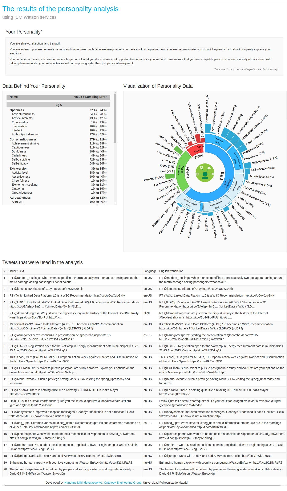
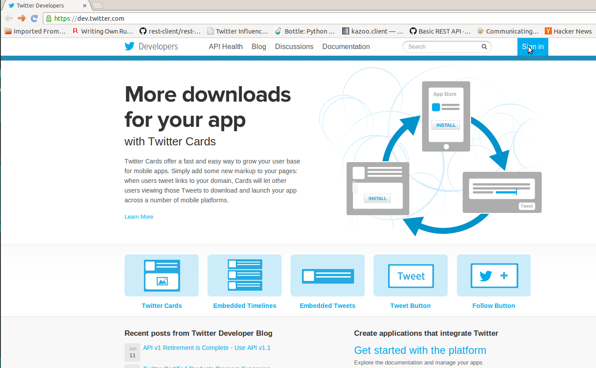
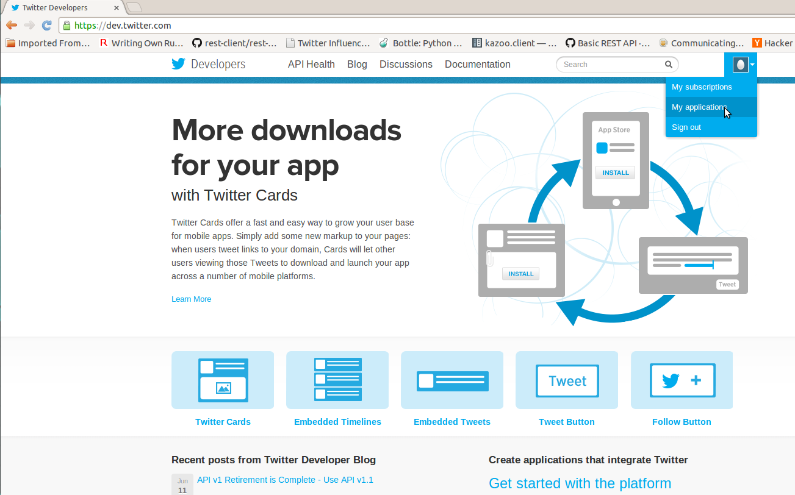
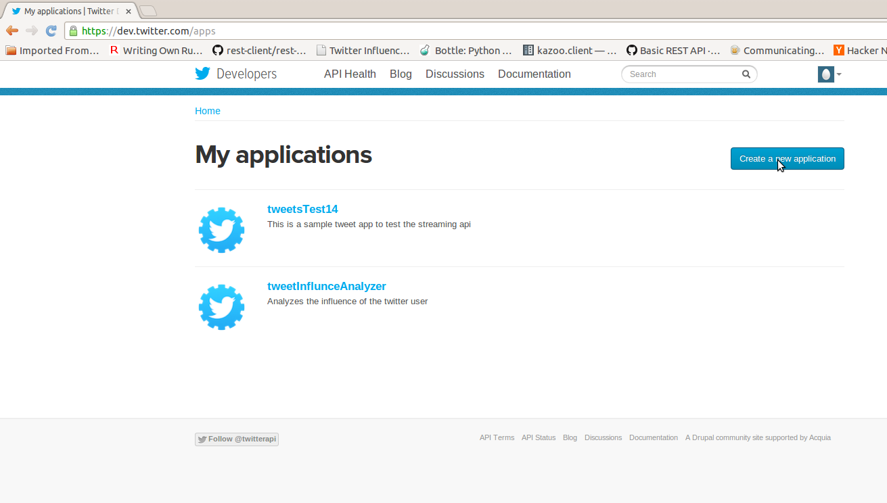
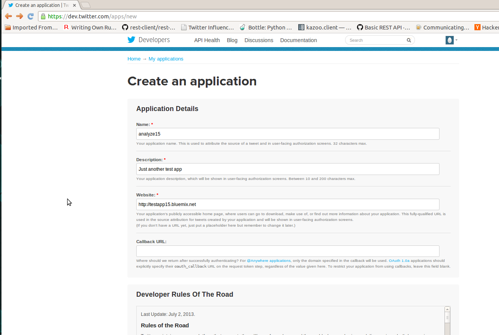
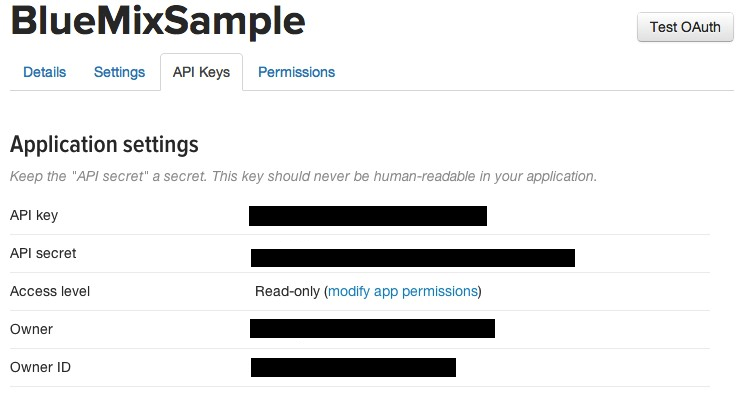

# What is Twitter Personality Insights Analyzer?

This is a simple application that I built to play with [IBM Watson Services](http://www.ibm.com/smarterplanet/us/en/ibmwatson/developercloud/services-catalog.html).
The business logic of the application is simple.

Given a Twitter id,
* the app extracts the last 10 tweets from the timeline
* uses the [Language Identification](http://www.ibm.com/smarterplanet/us/en/ibmwatson/developercloud/language-identification.html) service to identify the language of each tweet
* if a tweet is not in English, uses the [Machine Translation](http://www.ibm.com/smarterplanet/us/en/ibmwatson/developercloud/machine-translation.html) service to translate it to English
* uses the [Personality Insights](http://www.ibm.com/smarterplanet/us/en/ibmwatson/developercloud/personality-insights.html) to build a profile of personality and social characteristics based on the tweets

The main idea was to check how easy/hard it is to build an application using the IBM Watson Services. This application used the [Bluemix Twitter Influence Java Sample](https://github.com/ibmjstart/bluemix-java-sample-twitter-influence-app) and
getting started java samples from each of the services as a guide.

## Screenshots ##

This is the home screen of the app. You can enter a twitter screen name in the text box and click the Analyze button to see their influence.

After entering the twitter name and clicking the Analyze button, the personality results will be shown in the next screen along with the tweets that were used as data.

# Prerequisite #

## Twitter access token ##

This application requires an access token to access the tweets.

### These are some of the steps and screen-shots to register your app with Twitter:

-   You can register the app over [here](https://dev.twitter.com/). When you click on the link you are forwarded to Twitter's developer site. You need to Sign-in with your Twitter account. If you dont have the twitter account you can sign-up with twitter and get then login with the new account credentials. The Sign-in button is on the top right.

    

-   After logging in with the Twitter credentials, you can manage your existng applications or create/register new applications with Twitter by clicking on 'My Applications' as shown in the screenshot.

    

-   Now you can see your existing applications if you have any registered before. You can register the app by clicking on 'Create a new application' button.

    

-   You will now have to fill the application details, agree the rules and the submit the form to register the app.

    

-   After registering the app, you'll see the API key and API
    secret values under the API Keys tab. To get your API access token, click
    'Create my access token' at the bottom of the page and you will see the generated access token and access token secret
    

-   You can just copy these tokens (API  key, API secret, access token, access token secret) in your application and you are all set to use the Twitter API. You will need to check the [documentation](https://dev.twitter.com/docs/api/1.1) to use the various REST APIs.

# How to Run and Deploy the Twitter Personal Analyzer #

Give it a try! Click the button below to fork into IBM DevOps Services and deploy your own copy of this application on Bluemix. Note the app will not yet work; you need to set the environment variables.

The environment variables are your twitter API keys.

To set them, click on your app within Bluemix, click `Environment Variables` on the left pane, then select `USER_DEFINED` to add the three necessary environment variables.

## License ##
Licensed under the Apache License, Version 2.0 (the "License"); you may not use this file except in compliance with the License. You may obtain a copy of the License at

     http://www.apache.org/licenses/LICENSE-2.0
